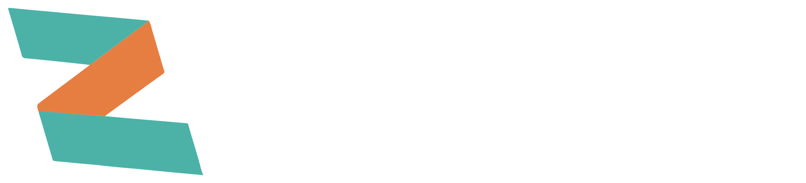

# Introduction

Zephyr3d is a set of API for 3D rendering within the browser. 

It mainly contains two parts: the device API and the scene API. 

### The device API

  The device API provides a unified set of Direct3D-like abstract interfaces that give you access to the underlying rendering interface provided by WebGL or WebGPU. 
  It's main features:

  - Low level GPU object management (Texture, Sampler, Buffer, Shader, Framebuffer, etc)
  - Write shaders in javascript without knowing GLSL and WGSL.
  - Similar to the WebGPU architecture, resources are managed using BindGroups.

### The scene API

  The scene API is a high level rendering framework powered by the device API. 
  It's main features:

  - PBR rendering with IBL support
  - Clustered renderer that supports both WebGL/WebGL2/WebGPU
  - Importing of GLTF models
  - Importing of JPG/PNG/DDS/HDR textures
  - Octree based geometry culling and picking
  - Skeletal animation and keyframe animation
  - Automatically geometry instancing
  - ChunkedLOD based terrain
  - Linear/Exp/Exp2 fogging
  - HDR rendering
  - Shadow maps with PCF/ESM/VSM support
  - Cascaded shadow maps
  - Built-in imgui integration

## Examples

Check out the [Examples](/examples/index.html).
